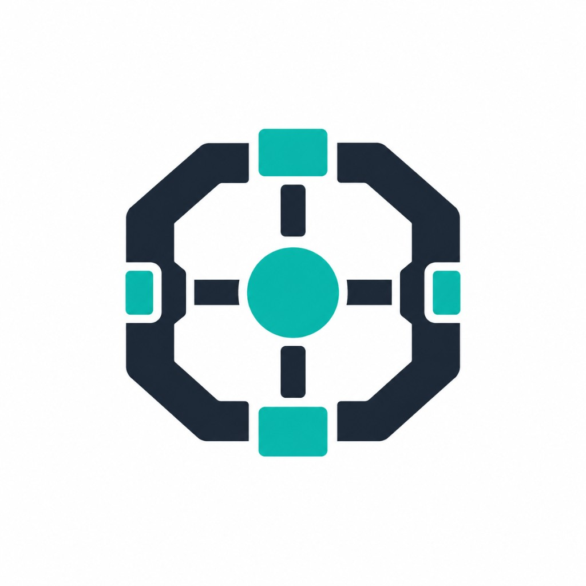

<p align="center">
  
</p>

# AI Engineering Harness

A vendor-neutral foundation for using AI agents in software engineering and related technical disciplines.

## What is this?

An **AI Engineering Harness** is a reusable architecture for agent-assisted work.

It organizes persistent behavior, specialized procedures, tools, security controls, and operational practices so agents can work more reliably across projects and environments.

This is not a giant prompt collection. It is a structured harness based on Context Engineering, Rules, Skills, Tools, MCP, security, evaluation, observability, and production practices.

## Goals

- Context efficiency
- Reusable agent behavior
- Tool integration
- Security
- Evaluation
- Observability
- Production readiness

## Architecture

Canonical **authoring** layout (this repository):

```text
rules/       # persistent agent behavior (canonical authoring)
skills/      # specialized procedures (canonical authoring)
docs/        # documentation (includes human Tool catalog docs)
profiles/    # role-specific compositions (canonical authoring)
.harness/    # project harness configuration (intent)
schemas/     # JSON Schemas for configuration (canonical authoring)
scripts/     # small development utilities
adapters/    # agent compatibility layer
harness/     # thin CLI + content pack locator
tools/       # Tool Registry (canonical authoring)
```

Provider-specific output (for example `.cursor/`) is produced by adapters.
Canonical resources stay vendor-neutral in the content pack.

### Installed Engine vs Project Content vs Vendor Projection

| Layer | How it appears | Role |
| --- | --- | --- |
| **Installed Engine** | `pip install -i https://test.pypi.org/simple/ --extra-index-url https://pypi.org/simple/ ai-engineering-harness==0.1.1` → `harness` + `adapters` + content pack | CLI, resolution, generation, detection, health |
| **Built-in content pack** | `harness/content/_data` (installed) or repo root (source authoring) | Immutable Profiles, Rules, Skills, Schemas, Tools shipped with the package |
| **Project content** | `harness init` → `.harness/` (harness.yaml + profiles/rules/skills/schemas/tools/docs) | Project Harness source of truth after init |
| **Vendor Projection** | `harness generate cursor\|claude` → `.cursor/`, `.claude/` at project root | Self-contained agent-specific generated files |

End users install the package; they do **not** need this repository checkout.
The repository is only required for Harness development.

Harness version `0.1.1` ships Content Pack version `0.1.1` (same distribution version for now).

Consumer projects keep Harness content under `.harness/`. They do **not** place
`profiles/`, `rules/`, `skills/`, `schemas/`, `tools/`, or `docs/` at the project
root for Harness. `.cursor/` and `.claude/` remain at the project root.

### Rules, Skills, Tools, Profiles, Configuration

| Layer | Role |
| --- | --- |
| **Rules** | Persistent agent behavior |
| **Skills** | Specialized procedures |
| **Tools** | External capabilities (CLI, MCP, services, utilities, …) |
| **Profiles** | Reusable default compositions of Rules, Skills, and Tools |
| **Configuration** | Project selection of a Profile and optional overrides (`.harness/harness.yaml`) |

The **Tool Registry** (`tools/registry.yaml`) is the machine-readable catalog of Tool identity and operational metadata. Human documentation lives in [`docs/tools/`](docs/tools/). Read-only Tool Detection and Health are implemented in the CLI (`harness tools health`). Installers and runtime wrappers under `tools/` are not implemented yet.

## Configuration

Project configuration is declarative and lives in [`.harness/harness.yaml`](.harness/harness.yaml).

- Configuration declares desired state (which Profile and resource lists apply)
- Profiles compose defaults ([`profiles/`](profiles/))
- Rules define persistent behavior
- Skills define specialized procedures
- Tools provide external capabilities

Contract: [`docs/architecture/configuration.md`](docs/architecture/configuration.md)

## CLI

Thin interface over existing Harness validation and adapters. Architecture: [`docs/architecture/cli.md`](docs/architecture/cli.md).

### Install

The distribution name is `ai-engineering-harness`. The import package remains `harness`.

**Recommended:** install inside a virtual environment so the `harness` command is on `PATH` after activation (avoids the common Windows issue where a user-level `pip install` puts scripts in a folder that is not on `PATH`).

```bash
cd my-project
python -m venv .venv

# Windows (PowerShell)
.\.venv\Scripts\Activate.ps1

# macOS / Linux
# source .venv/bin/activate

pip install -i https://test.pypi.org/simple/ --extra-index-url https://pypi.org/simple/ ai-engineering-harness==0.1.1
harness version
```

Without a venv, prefer the module entrypoint (always works if the package is installed for that Python):

```bash
pip install -i https://test.pypi.org/simple/ --extra-index-url https://pypi.org/simple/ ai-engineering-harness==0.1.1
python -m harness version
```

From a repository checkout (local / editable development):

```bash
pip install .
# or: pip install -e .
```

Package source: [TestPyPI](https://test.pypi.org/project/ai-engineering-harness/). Production PyPI publishing and release automation are **not** set up yet.
Dependencies (`PyYAML`, `jsonschema`) are resolved from PyPI; `--extra-index-url` is required for TestPyPI installs. If pip still only offers `0.1.0`, retry with `--no-cache-dir`.

### Installed invocation

`harness` and `python -m harness` share the same `harness.cli:main` entrypoint.

```bash
harness --help                    # or: python -m harness --help
harness version
harness init --profile software-engineer
harness init --profile software-engineer --dry-run
harness validate
harness generate cursor --dry-run
harness generate cursor
harness generate claude --dry-run
harness generate claude
harness tools health rtk
```

If `harness` is not found:

1. Activate your venv (recommended), or
2. Use `python -m harness …`, or
3. On Windows after a global/user install, add `%APPDATA%\Python\Python3xx\Scripts` to your user `PATH` and reopen the terminal (`python -c "import sysconfig; print(sysconfig.get_path('scripts'))"` prints the exact folder).

### Development invocation

From a repository checkout (package on `PYTHONPATH` or after editable install):

```bash
python -m harness --help
python -m harness init --profile software-engineer --dry-run
python -m harness validate
python -m harness generate cursor --dry-run
python -m harness generate claude --dry-run
python -m harness tools health rtk
python -m harness version
```

### Engine vs project resources

`pip install` installs the **Installed Engine** (Python packages `harness` and
`adapters`, plus a read-only built-in content pack). `harness init` materializes
**Project Content** under `.harness/`. After init, that tree is the project's
Harness source of truth. `harness generate` creates **Vendor Projection** files
at the project root (`.cursor/`, `.claude/`). See
[`docs/architecture/cli.md`](docs/architecture/cli.md#installed-engine-vs-project-content-vs-vendor-projection).

Typical external-project flow (no repository clone required):

```bash
cd my-project
python -m venv .venv
# Windows: .\.venv\Scripts\Activate.ps1
# macOS/Linux: source .venv/bin/activate
pip install -i https://test.pypi.org/simple/ --extra-index-url https://pypi.org/simple/ ai-engineering-harness==0.1.1
harness init --profile software-engineer
harness validate
harness generate cursor
# or:
harness generate claude
```

After upgrading the Harness package, regenerate projections so agents pick up
updated Rules and Skills. Re-run `harness init` only when you intentionally want
to refresh project-local content (fail-closed on conflicts).

Validate configuration:

```bash
pip install .
python -m harness validate
# equivalent without packaging:
# pip install -r scripts/requirements.txt
# python -m harness validate
# python scripts/validate-config.py
```

Tests:

```bash
python -m unittest discover -s tests -v
```

## Principles

- Understand before modifying
- Make the minimal sufficient change
- Reuse before creating
- Do not invent APIs, paths, or capabilities
- Load minimum sufficient context
- Prefer least privilege
- Verify before claiming success
- Keep the harness useful across agents and disciplines

See [AGENTS.md](AGENTS.md) for the full agent instructions, [rules/](rules/) for canonical Rules, and [skills/](skills/) for canonical Skills. The Skills contract is defined in [docs/architecture/skills.md](docs/architecture/skills.md). The Tools contract is defined in [docs/architecture/tools.md](docs/architecture/tools.md). The Configuration contract is defined in [docs/architecture/configuration.md](docs/architecture/configuration.md).

## Adapters

Adapters translate canonical Harness configuration into agent-specific files:

```text
Harness configuration
        ↓
     Adapter
        ↓
Agent-specific configuration
```

`.harness/harness.yaml` remains the source of truth. Adapters must not invert that flow.

| Adapter | Status | Docs |
| --- | --- | --- |
| Cursor | experimental | [`adapters/cursor/`](adapters/cursor/) |
| Claude | experimental | [`adapters/claude/`](adapters/claude/) |

Architecture: [`docs/architecture/adapters.md`](docs/architecture/adapters.md) · Contract: [`adapters/ARCHITECTURE.md`](adapters/ARCHITECTURE.md)

Generate agent projections:

```bash
python -m harness generate cursor
python -m harness generate cursor --dry-run
python -m harness generate claude
python -m harness generate claude --dry-run
# equivalent adapter entrypoints:
python -m adapters.cursor.generate
python -m adapters.claude.generate
```

## Supported Environments

The project aims to remain **vendor-neutral**.

It is intended to support multiple agent environments through adapters, including Claude, Cursor, Codex, Gemini, and other compatible agents.

The Cursor and Claude adapters are experimental. Additional agent adapters are not implemented yet.

## Roadmap

| Phase | Status | Focus |
| --- | --- | --- |
| Agent instructions (`AGENTS.md`, `CLAUDE.md`) | Done | Project principles and agent entrypoint |
| Rules foundation | Done | Canonical Rules + project docs |
| Skills architecture | Done | Skill contract + core and AI Engineering Skills |
| Tool Registry architecture | Done | Catalog, template, evaluation policy, RTK docs |
| Profiles + `.harness/` configuration | Done | Declarative config, schema, syntax validator |
| Adapter architecture + Cursor adapter | Done (experimental) | Harness → agent projection |
| Claude adapter | Done (experimental) | Harness → `.claude/` projection |
| Initial CLI (`validate`, `generate`, `tools health`) | Done | Thin interface over existing APIs |
| Local packaging (`pip install .` → `harness`) | Done | Installable engine + read-only content pack |
| Tool Registry + Detection + Health | Done | Declarative catalog; read-only local probes |
| Profile / project scaffolding (`harness init`) | Done | Materialize project content from the installed pack |
| Runtime Tool installers / wrappers | Not implemented | Install, configure, or package Tools |
| TestPyPI package (`ai-engineering-harness==0.1.1`) | Done | Installable via TestPyPI index |
| Production PyPI / release automation | Not implemented | Stable public distribution on pypi.org |
| Additional Profiles (security, …) | Not implemented | Content-pack additions |
| Additional agent adapters (Codex, …) | Not implemented | More vendor projections |
| `harness doctor` / more CLI commands | Not implemented | Operational tooling |
| MCP, RTK wiring, RAG, observability runtime | Not implemented | External capability wiring |

## License

See [LICENSE](LICENSE).
